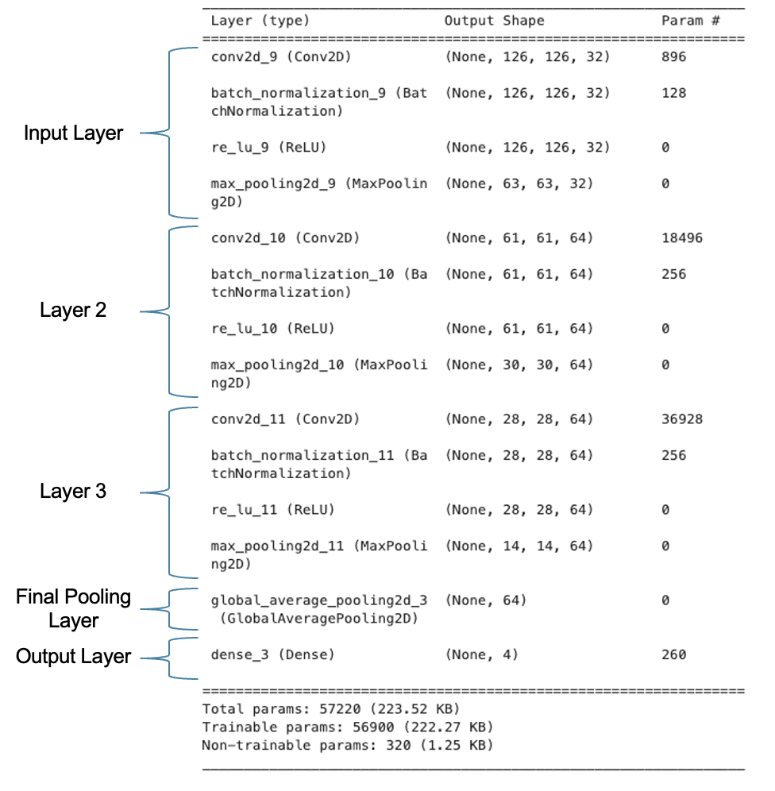

# Sound-Classification

## Business Overview
The goal of this project is to build a model that accurately classifies various sounds. The classes included are 
1. Speech
2. Music
3. Animal
4. Vehicle 

I went about this in two ways, 1. Extracting numerical features, such as tempo, Mel-frequency cepstral coefficients (MFCCs), chroma features, and spectral features, from the audio files and building several traditional machine learning models, and 2. Creating and using Mel Spectrograms to build a convolutional neural network.

I evaluated model performance based on accuracy, as the dataset is fairly balanced and, in this context, I am not particularly concerned with either false positives or false negatives. 

## Data Overview & Understanding
For this project, I used [AudioSet](https://research.google.com/audioset/), a publicly available dataset of approximately 2.1 million human annotated, ten second YouTube clips. The dataset can be downloaded as a csv file that includes YouTube URL/ID's, specific ten second time ranges from which audio can be extracted, and class labels. For nearly every row, multiple labels are listed, with anything as broad as "Music" or as granular as "Plucked string instrument". I selected a subset of the larger dataset, focusing specifically on the four relatively broad classes listed above. To further explore how audio was extracted from the YouTube videos and downloaded to my machine please refer to this [Jupyter Notebook](./Audio_Pull.ipynb). 

Numerical features were extracted from audio files using Librosa. In total I extracted 64 features, including rhythmic features, chroma features, and spectral features. For reference, chromas represent the energy distribution of pitch classes, while spectral content refers to the distribution of energy across different frequencies. To further explore how audio features were extracted from the audio files in the dataset please refer to this [Jupyter Notebook](./Feature_Extraction.ipynb)

An additional aspect of compiling the dataset was then creating Mel Spectrograms. A Mel Spectrogram is a visual representation of audio with time on the x-axis, frequency on the y-axis, and color representing amplitude. In creating Mel Spectrograms, the linear frequency scale of the original signal is converted to the Mel Scale, a logarithmic scale that better reflects the way in which humans perceive pitch. The Mel Scale was created by Harvey Fletcher, an American psychologist who conducted psychoacoustic experiments on the perception of pitch and frequency in the early 20th century.

See below an example of a Mel Spectrogram of a ten second clip from an electronic dance music(EDM) song:

To further explore how Mel Spectrograms for the audio files in the dataset were created please refer to this [Jupyter Notebook](./Spectrogram_Build.ipynb)

Also of note, the dataset is fairly balanced across classes:
* Speech: 27%
* Music: 25%
* Animal: 22%
* Vehicle: 26%

Both the spectrograms dataset and features dataset were split into train and test sets prior to preprocessing and model building.

## Modeling

### Traditional Machine Learning Models
Using the numerical features extracted, I built four types of machine learning models.
1. Random Forest
2. Logistic Regression
3. AdaBoost Classifier
4. XGBoost Classifier

The data was scaled using StandardScaler, and I used Principal Component Analysis(PCA) to help mitigate multicollinearity. PCA is a dimensionality reduction technique that works by transforming the original features into a new set of uncorrelated variables called principal components. These variables are linear combinations of the original features and they capture the maximum variance in the data. For each model, GridSearchCV was used to tune hyperparameters. Train and validation accuracy scores from the best performing model for each model type are shown below. Despite hyperparameter tuning, it appears the AdaBoost, XGBoost, and Random Forest models are overfitting; however, the XGBoost model still performs best on validation.

Below are the top ten features by importance per the XGBoost classifier, the best performing of the above models. Signal kurtosis and signal skewness, both measures of signal distribution, are two of the most impactful features. Skewness measures the asymmetry of the distribution, meaning whether the audio signal is more concentrated on either tail. Kurtosis measures the tailedness of the distribution or, in other words, the sharpness of the peak of the distribution in comparison to a normal distribution. In Addition, spectral contrast across four different frequency bands are also significantly impactful features. Spectral contrast measures the difference in amplitude within a defined frequency band. Multiple Mel-frequency cepstral coefficients(MFCC) are also top features. These coefficients represent the short-term power spectrum of a sound.

### Convolutional Neural Network (CNN)
In addition to the machine learning models discussed above, I built a CNN for image classification and trained the model on the spectrogram images created from the audio files in the dataset. The structure of the CNN is shown here:

See below train and validation accuracy scores. EarlyStopping was defined with validation accuracy monitored, patience set to five epochs, and best weights restored.

### Model Evaluation
Per the below comparison, the CNN is the best performing model.

When tested on unseen data, the CNN produces an **accuracy score of 75%**.

## Recommendations and Next Steps
I recommend using this model to classify various sounds. For example, one could feed this model a set of audio files from a streaming platform in order to segment out songs and podcasts and discard audio that is not a song or podcast, such as animal and vehicle sounds. One could also use this model as a starting point to develop a virtual assistant that can both recognize and interpret speech and music, provide song information, or respond to speech requests.

Some potential next steps include:
* Training models on a larger dataset in hopes of improving accuracy
* Adding additional sound classes to increase number of use cases

## Additional Materials
An application that leverages my final CNN model can be found [here](https://sound-classifier-app.streamlit.app/). Give it a try on your own audio files!

Please also review my full analysis in this [Jupyter Notebook](./Sound_Classifier_Models.ipynb), in addition to the supporting notebooks discussed above, and my presentation [here](./Sound_Classification_Presentation.pdf) . 

