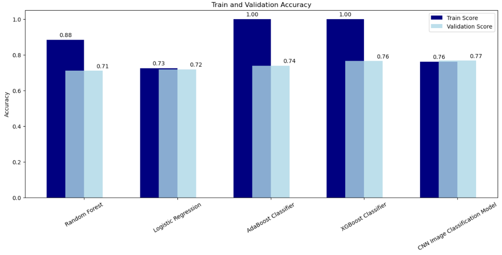

# Sound-Classification

## Business Overview
The goal of this project is to build a model that accurately classifies various sounds. The classes included are i) Speech ii) Music iii) Animal and iv) Vehicle. I went about this in two ways, 1. Using spectrogram images to train a convolutional neural network. 2. extracting numerical features, such as tempo, Mel-frequency cepstral coefficients (MFCCs), chroma features, and spectral features, from the audio files and training various classification models.
The following models were explored:
1. Convolutional Neural Network (CNN)
2. Random Forest
3. Logisitic Regression
4. AdaBoosted Classifier (using both Decision Tree and Random Forest estimators)
5. XGBoost Classifier

I evaluated model performance based on accuracy, as our dataset is fairly balances and, in this context, I am not particularly concerned with either false positives or false negatives 

## Data Overview & Understanding
For this project, I used AudioSet, a publicly available dataset of approximately 2.1 million human annotated, ten second YouTube clips. The dataset can be downloaded as a csv file that includes YouTube URL/ID's, specific ten second time ranges to be extracted, and class labels. For nearly every row, multiple labels are listed, with anything as broad as "Music" or as granular as "Plucked string instrument". I selected a subset of the larger datset, focussing specifically on the four reletively broad classes listed above. To further explore how these audio files were extracted from the youtube videos and downloaded to my machine please refer to this [Jupyter Notebook](./Audio_Pull.ipynb). 

An additional aspect of compiling the dataset was then creating Mel Spectrograms. A Mel Spectrogram is a visual representation of audio with time on the x-axis, frequency on the y-axis, and color representing amplitude. In creating Mel Spectrograms, the linear frequency scale of the original signal is converted to the Mel Scale, which better reflects the way in which humans percieve pitch. The Mel Scale was created by Harvey Fletcher, an American psychologist who conducted psychoacoustic experiments on the perception of pitch and frequency in the early 20th century.

See below an example of a Mel Spectrogram of a ten second clip from EDM song:

To further explore how Mel Spectrograms for all audio files in the dataset were created please refer to this [Jupyter Notebook](./Spectrogram_Build.ipynb)

Additionally, numerical features were extracted from the audio files and saved as a csv file for future use. To further explore how audio features were extracted for all audio files in the dataset please refer to this [Jupyter Notebook](./Feature_Extraction)

Also of note, the dataset is fairly balanced:
* Speech: 27%
* Music: 26%
* Animal: 22%
* Vehicle: 25%

## Modeling
As stated above I approached this classification problem in two ways: i) A CNN model trained on spectrogram images and ii) various classification models trained on numerical features extracted from audio files. Hyperparameter tuning using GridSearchCV was performed on the random forest, logistic regression, AdaBoost classifier, and XGBoost models, and various parameters, such as kernal initializer and regularization factor, were flexed in tuning the CNN model.

Below is a comparison of train and validation scores:

For every model except the logitistic regression, the train score is significantly higher than the validation score, suggesting, despite hyperparameter tuning, the models are overfitting. This should be addressed as a next step. 

The XGBoost Classifier performed best on validation despite overfitting likely occuring. When evaluated on unseen test data, the model produces an accuracy score of 74%.

## Recommendations and Next Steps
I recommend using this model to classify various sounds. For example, one could feed this model a set of audio files from a streaming platform in order to segment out songs and podcasts and discard audio that is not a song or podcast, such as animal and vehicle sounds. One could also use this model as a starting point to develop a virtual assistant that can both recognize and interpret speech and music, provide song information, or respond to speech requests.

Given the likelihood of overfitting in most models, this is just a starting point. Some next steps include.
* Train models on a larger dataset
* Add additional sound classes to increase number of use cases

## Additional Materials
Please review my full analysis in this [Jupyter Notebook](./Sound_Classifier_Models_2.ipynb) and my presentation [here](./Sound_Classification_Presentation.pdf) . 

